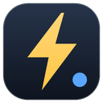
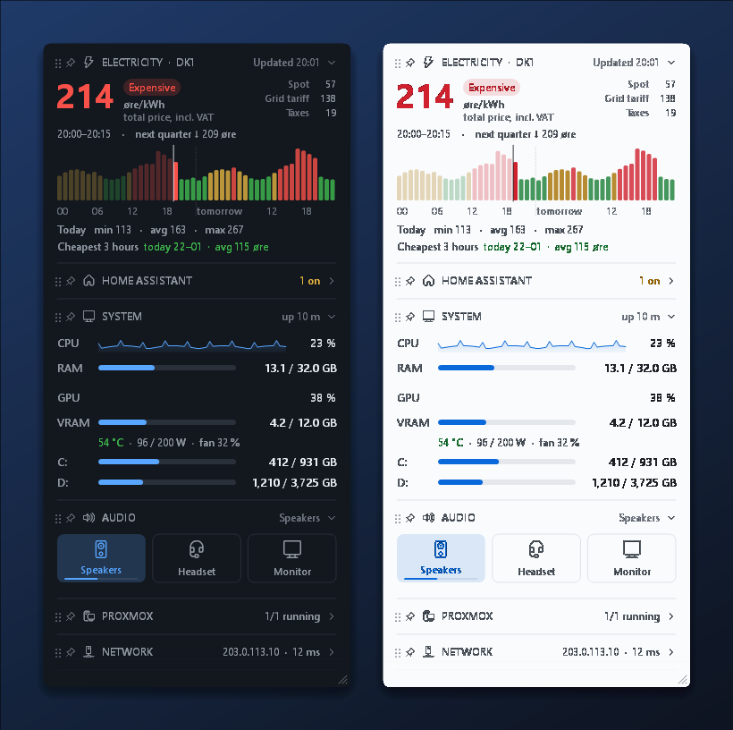
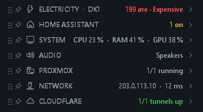
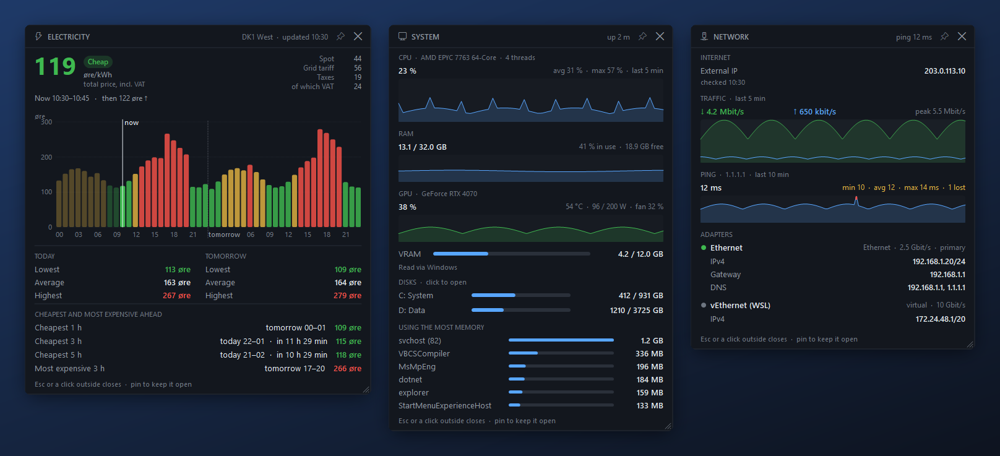
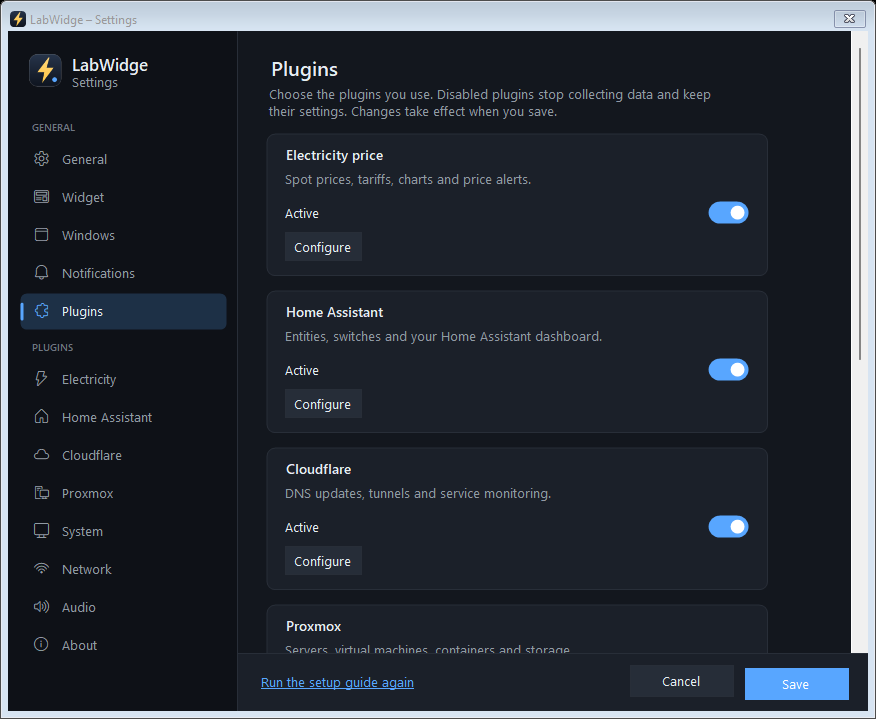

  

<h1 align="center">LabWidge</h1>

  <b>Your electricity price, your PC and your home lab – at a glance, right by the clock.</b> 
  A free, open-source desktop widget for Windows 10 and 11.

  
  
  
  
  

  <a href="https://github.com/Karalumpas/labwidge-releases/releases/latest"><b>⬇ Download for Windows</b></a>
  &nbsp;·&nbsp; <a href="#install">Install</a>
  &nbsp;·&nbsp; <a href="#features">Features</a>
  &nbsp;·&nbsp; <a href="#electricity-prices-in-14-countries">Countries</a>
  &nbsp;·&nbsp; <a href="#faq">FAQ</a>

  

LabWidge sits quietly next to the clock and answers the questions you would otherwise open five apps for:
*Is power cheap right now? When is it cheapest today? Is my server up? What is my IP? Which speakers are on?*
It is small, fast and private – no account, no ads and no telemetry.

## Features

**🧩 Choose your plugins**
- Electricity price, system, network, audio, Home Assistant, Cloudflare and Proxmox are bundled internal plugins.
- Enable or disable them under **Settings → Plugins**. Disabled plugins stop polling; their configuration and pinned window positions are kept.
- Each active plugin has its own settings page, compact summary, expanded section and detachable detail window.

**⚡ Electricity price – save money without thinking about it**
- The price right now, coloured green, yellow or red, with a chart for today and tomorrow and the **cheapest 3 hours**.
- **Notifications** before the cheap hours start and before power gets expensive – time the dishwasher, the car or the heat pump.
- Day-ahead spot prices for **14 European countries**. In Denmark it is your real total price: grid tariff (found automatically
  from your grid company), taxes, your supplier's add-on and VAT. Elsewhere: spot price plus your own add-on and VAT.
- The tray icon's bolt changes colour with the price, so you can see it even when the widget is hidden.

**🖥️ Your PC**
- CPU with a live chart, RAM, every fixed disk (click to open it) and the graphics card – NVIDIA cards also show temperature,
  power draw and fan speed.
- Network: external IP, local IP per adapter, gateway, DNS, ping and traffic. Click an address to copy it.
- **Audio switching in one click** – one button per output (speakers, headset, monitor), the volume on the scroll wheel,
  a microphone mute button and the battery of supported wireless headsets (Corsair HS80 and similar).

**🏠 Your home lab (optional)**
- **Home Assistant** – lights, switches and sensors you choose, or a full Home Assistant dashboard in a pop-up panel.
- **Proxmox VE** – CPU, RAM and storage of your server, and start, shut down or reboot VMs and containers.
- **Cloudflare** – keeps your DNS A records up to date when your IP changes, and shows whether your tunnels and the services
  behind them are up.

**🪟 Detail windows**
- Every section opens in a larger window with much more detail: the price chart with a price scale and the cheapest periods ahead,
  five minutes of CPU, RAM, GPU, traffic and ping history, all disks and adapters, and every audio device with its volume.
- **Drag a section out of the widget** to drop it on the desktop as a window – or click the window button in its header.
- **Pin a window** to keep it open; it remembers where it was and comes back when LabWidge starts.

**✨ Made to stay out of your way**
- Collapse, reorder and pin sections; resize the widget; double-click for compact plugin summaries.
- Dark and light theme (or follow Windows), adjustable opacity, always on top if you want.
- English and Danish. Updates install themselves while you are away from the PC.
- A modern settings window in the same theme: choose sections, disks, the ping target (e.g. your router), refresh intervals for
  your home lab and how the windows behave.

   
  The compact view – double-click the widget to switch.

   
  Detail windows for the electricity price, system and network – drag a section out of the widget to open one.

   
  The settings follow the widget's light or dark theme.

## Install

1. Download **`LabWidge-Setup-<version>.exe`** (about 7 MB) from the [latest release](https://github.com/Karalumpas/labwidge-releases/releases/latest).
2. Run it and choose your **language** and **country** – the country decides which electricity prices you see.
3. A short setup guide helps with the electricity price, notifications and the look. Everything else can wait until you want it.

The installer adds Microsoft's .NET 8 Desktop Runtime if it is missing (with your permission) and installs LabWidge for your user
only. Uninstall it like any other app under **Settings → Apps**.

> **"Windows protected your PC"?** LabWidge is not code-signed yet (a free certificate from the SignPath Foundation is on its way),
> so SmartScreen may warn about it. Choose **More info → Run anyway**. Every release is built by GitHub Actions from this source code.

## Electricity prices in 14 countries

Choose your country in the installer or under **Settings → Electricity**. All sources are free, need no account and are only
contacted for the country you choose. "Other country" hides the electricity price.

| Country | Price areas | Source | Shown in |
|---|---|---|---|
| 🇩🇰 Denmark | DK1, DK2 | [Energi Data Service](https://www.energidataservice.dk/) + grid tariffs from Datahub | øre/kWh |
| 🇸🇪 Sweden | SE1–SE4 | [elprisetjustnu.se](https://www.elprisetjustnu.se/) | öre/kWh |
| 🇳🇴 Norway | NO1–NO5 | [hvakosterstrommen.no](https://www.hvakosterstrommen.no/) | øre/kWh |
| 🇫🇮 Finland · 🇪🇪 Estonia · 🇱🇻 Latvia · 🇱🇹 Lithuania | FI, EE, LV, LT | [Elering](https://dashboard.elering.ee/) | ct/kWh |
| 🇩🇪 Germany · 🇱🇺 Luxembourg · 🇦🇹 Austria | DE-LU, AT | [aWATTar](https://www.awattar.de/) | ct/kWh |
| 🇳🇱 Netherlands | NL | [EnergyZero](https://www.energyzero.nl/) | ct/kWh |
| 🇵🇱 Poland | PL | [PSE](https://raporty.pse.pl/) | gr/kWh |
| 🇪🇸 Spain · 🇵🇹 Portugal | ES, PT | [OMIE](https://www.omie.es/) | ct/kWh |

More European countries are coming. Prices are shown in your PC's local time; VAT follows your country's usual rate for
household electricity and can be changed.

## Tips

- **Left-click** the bolt by the clock to show or hide the widget; **right-click** for the menu and **Settings…**.
- **Click a header** to collapse a section – a summary stays in the header.
- **Drag the handle** (⋮⋮) by a header to reorder sections. **Click the pin** to keep a section at the top or bottom while the rest scrolls;
  right-click the header for more options, such as pinning only the summary.
- **Drag a section sideways out of the widget** to open it as a window on the desktop. Windows close with Esc or a click outside –
  unless you pin them. Drag a window's header to move it, and an edge to resize it.
- **Drag an edge or corner** to resize the widget, and **drag anywhere else** to move it.
- **Hover** over almost anything – prices, bars, addresses – for details. The status in each header tells you whether data is fresh.

## Home lab setup

<b>Home Assistant</b>

1. In Home Assistant, create a token under **your profile → Security → Long-lived access tokens**.
2. Under **Settings → Home Assistant** in LabWidge, enter the address (e.g. `http://192.168.0.10:8123`) and the token.
3. Click **Load entities** and tick up to 20 lights, switches and sensors.

The widget shows a one-line summary (e.g. "5 on"); click it to open the panel. Type a dashboard path such as `/lovelace/0` in the
**Dashboard** field to show a real Home Assistant dashboard in the panel (uses Microsoft Edge WebView2, included in Windows 11),
or leave it empty for a simple list of switches. Only the entities you chose are fetched.

<b>Proxmox VE</b>

Create an API token in Proxmox under **Datacenter → Permissions → API Tokens** and give it the role **PVEAuditor** on `/` to see
the status – add **PVEVMUser** to start, shut down and reboot machines from the widget. Enter the address, token ID and secret
under **Settings → Proxmox**. Self-signed certificates can be trusted from the settings page.

<b>Cloudflare DNS and tunnels</b>

Create a token under **My Profile → API Tokens** with **Zone → DNS → Edit**, and enter it with your zone ID under
**Settings → Cloudflare**. To see your tunnels too, add **Account → Cloudflare Tunnel → Read** and the account ID.
LabWidge updates all A records in the zone – or only the hosts you pick – when your external IP changes, and retries failed updates.
CNAME records are never changed.

## FAQ

**Is it really free?** Yes. LabWidge is open source under the MIT license, with no ads, no paid tier and no account.

**Does it collect any data?** No. It has no telemetry or analytics and only contacts the services needed for what it shows –
see [PRIVACY.md](PRIVACY.md) for the full list. Tokens are stored in Windows Credential Manager.

**Will it slow down my PC?** No. It is a small native Windows app that refreshes once a second while visible and almost nothing
when hidden.

**My country is not on the list.** Choose "Other country" and use everything else. Support for the rest of Europe is on its way –
[open an issue](https://github.com/Karalumpas/LabWidge/issues) if you would like your country next.

**How do updates work?** LabWidge checks for new versions once a day and installs them when you have not used the PC for
10 minutes – your settings are kept. This can be turned off under **Settings → Widget**.

## Contributing

Bug reports, ideas and pull requests are welcome in [Issues](https://github.com/Karalumpas/LabWidge/issues).
How to build, test and release is described in [docs/DEVELOPMENT.md](docs/DEVELOPMENT.md).

## Code signing

Free code signing provided by [SignPath.io](https://about.signpath.io/), certificate by [SignPath Foundation](https://signpath.org/)
(the application is pending). Only files built by GitHub Actions from this source code are signed – see
[CODE_SIGNING_POLICY.md](CODE_SIGNING_POLICY.md).

## License

[MIT](LICENSE) © 2026 Karalumpas
